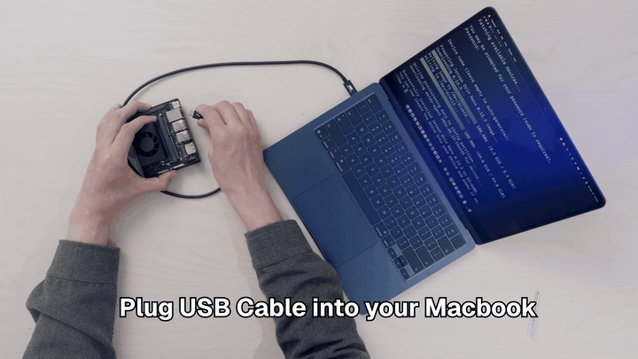
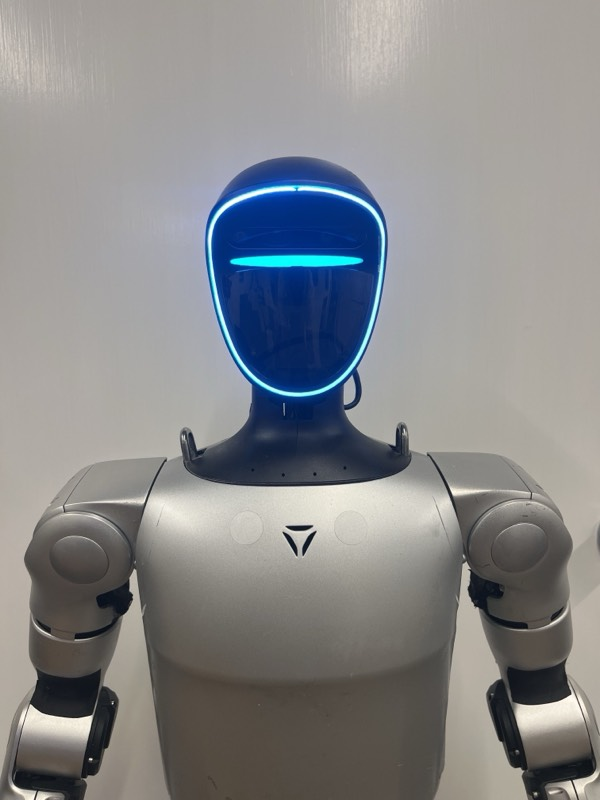
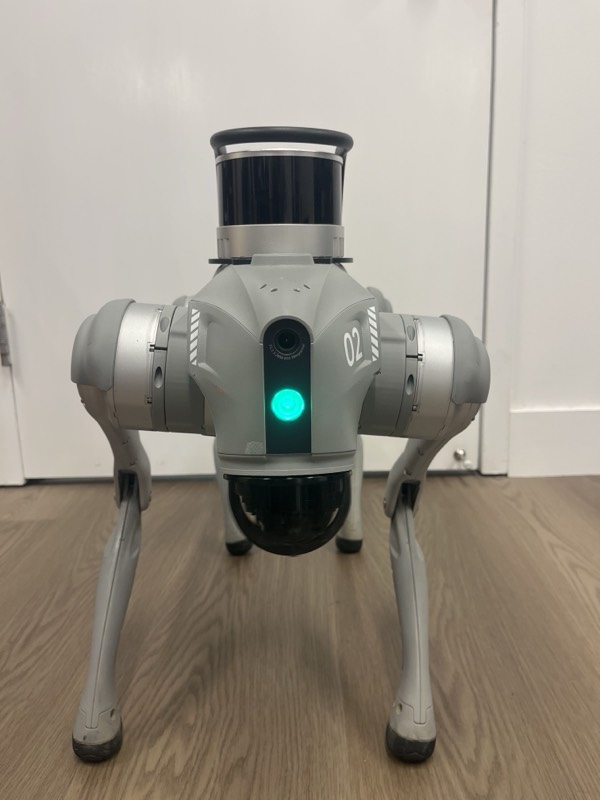
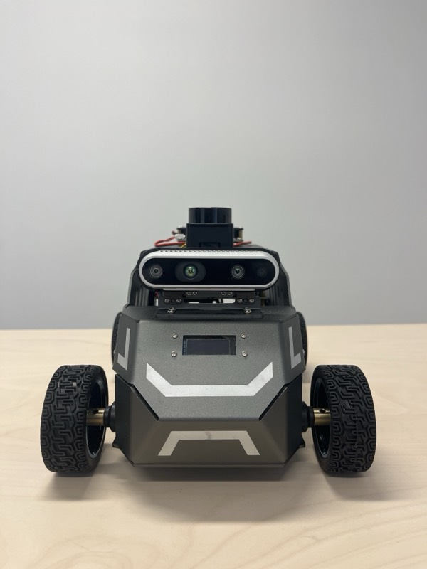
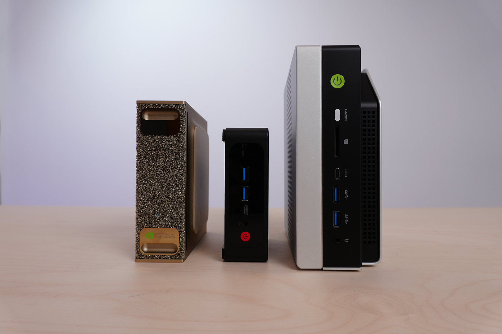

# WendyOS · Infrastructure for Physical AI

[](https://discord.gg/wendylabsinc)
[](https://docs.wendy.dev)
[](https://wendy.dev/blog)

Wendy brings Software Infrastructure to the **physical world**.
1. Deploy Rapidly
2. Scale Globally
3. Manage Remotely

### Deploy in Seconds

[](https://docs.wendy.dev/latest/installation/wendy-agent-unitree-g1/)
[](https://docs.wendy.dev/latest/installation/wendyos-nvidia-jetson-agx-thor/)
[](https://docs.wendy.dev/latest/installation/wendyos-raspberry-pi-5/)
[](https://docs.wendy.dev/latest/installation/linux/)
[](https://docs.wendy.dev/latest/installation/wendy-agent-macos/)
[](https://docs.wendy.dev/latest/installation/wendy-lite-esp32/)

Deploy code in less than a second from any machine to any Robot or Edge device.
- Supports any Linux Machine
- ESP32 Microcontrollers
- Headless macOS

You don't need any peripherals. Just your existing development machine and your target device.

### Any Developer Machine


<p align="center">
  
  <br>
  <em><code>wendy run</code> building and deploying an app to a Jetson over USB-C, with live logs.</em>
</p>

## Quick start

```sh
# 1. Install the Developer Tools
curl -fsSL https://install.wendy.dev/cli.sh | bash

# 2. Install WendyOS to your Robot, Jetson, or Raspberry Pi
wendy install

# 3. Build, deploy, and debug any (Docker) app
wendy run
```

Package-specific options are available via
[Homebrew, .deb, .rpm, and AUR](INSTALL.md).

### Common CLI Commands

```sh
wendy install # Install WendyOS on a device
wendy init # Create new project
wendy run # Build & Run an app
wendy run --watch # Watch for changes & Redeploy
wendy device top # Resource Stats
wendy device wifi # Manage wifi (connect/forget)
wendy device bluetooth # Game controllers, audio, etc..
wendy device ros2 # Interface with ROS2
```

## Starter Kits

<table>
  <tr>
    <td>
      <center>
        
        
        
      </center>
    </td>
    <td>
      <h3>Remote Control & Teleop</h3>
      <ul>
        <li>📱 (Mobile) Browser Support</li>
        <li>🎮 Game Controller Support</li>
        <li>☁️ Works with <a href="https://cloud.wendy.sh">Wendy Cloud</a></li>
      </ul>
      <h3>Source Code</h3>
      Start through <code>wendy init</code> or clone from GitHub:<br />
      <a href="https://github.com/wendylabsinc/templates/tree/main/python/g1-rc">G1 Humanoid</a> | <a href="https://github.com/wendylabsinc/templates/tree/main/python/go2-rc">Go2 Quadruped</a> | <a href="https://github.com/wendylabsinc/templates/tree/main/python/rc-car">Rosmaster Car</a>
    </td>
  </tr>
  <tr>
    <td>
      <center>
        
        <br /><em>"Hey Jetson, turn off the lights upstairs."</em>
      </center>
    </td>
    <td>
      <h3>Sovereign AI</h3>
      Run local LLMs on your device in seconds.<br />
      Integrate with documents, video feeds, audio and more.
      <h3>Source Code</h3>
      Start through <code>wendy init</code> or clone from Github:<br />
      <a href="https://github.com/wendylabsinc/templates/tree/main/python/llm">Local LLM</a> | <a href="https://github.com/wendylabsinc/templates/tree/main/python/camera-feed-yolo">Object Detection</a> | <a href="https://github.com/wendylabsinc/templates/tree/main/python/voice-ai-pipecat">Voice Assisant</a>
    </td>
  </tr>
</table>

## Cloud

All `wendy` commands can be run across the globe with [Wendy Cloud](https://cloud.wendy.dev). Manage your fleet in seconds with OTA, remote debugging, health checks and more.

With `wendy mcp setup` - you can develop apps, manage fleet deployments and more through your favorite LLM provider.

```sh
wendy cloud run # Run apps from anywhere
wendy cloud device camera view # Remote video
wendy cloud device audio listen # Remote audio
wendy cloud ros2 bag download # Download ROS2 recordings
```

### Control your fleet from 30,000 feet. Literally.

No matter where you are, you're in control. Even on the beach.
