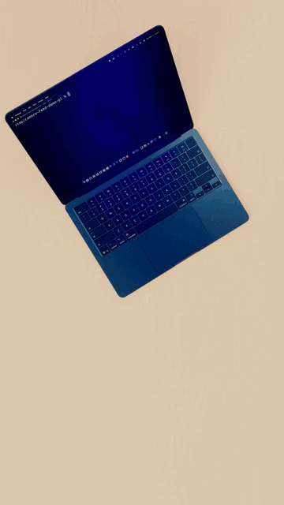

# WendyOS

[](https://opensource.org/licenses/Apache-2.0)


### Ship AI apps to robots, drones, and edge devices like you ship an app to a phone.

⭐ Star WendyOS to follow new hardware support and one-command robotics templates.

No need to spend hundreds of dollars on a monitor, a DisplayPort-to-HDMI adapter, a keyboard, or a mouse.
Plug in your device over USB-C from your Mac, Windows, or Linux machine, run `wendy run`, and your app builds, deploys, and streams logs back to your laptop.
No SD card juggling, no SSH setup, no internet required on the device.

<p align="center">
  
  <br>
  <em><code>wendy run</code> building and deploying an app to a Jetson over USB-C, with live logs.</em>
</p>

[](https://github.com/wendylabsinc/wendyos/releases)
[](LICENSE)
[](https://github.com/wendylabsinc/wendyos/actions/workflows/go-tests.yml)

Full developer docs: https://docs.wendy.dev/latest

## Quick start

```sh
# 1. Install the CLI (macOS or Linux)
curl -fsSL https://install.wendy.dev/cli.sh | bash

# 2. Flash WendyOS to your Jetson or Raspberry Pi (downloads the image,
#    writes the drive, and pre-seeds WiFi config)
wendy os install

# 3. Plug the device in over USB-C, then find it
wendy discover

# 4. Build, deploy, and stream logs from any app with a Dockerfile
wendy run
```

Try it with the sample apps in [Examples](Examples/), including GPU, DeepStream
vision, and HTTP server examples.

# Install

WendyOS is like iOS for developing, deploying, and debugging
apps on edge devices such as NVIDIA Jetson, AGX, Thor, Raspberry Pi, and Linux machines.
This repository contains the `wendy` CLI and the `wendy-agent` runtime service.

WendyOS images _already_ include `wendy-agent`. If you are looking for the
Yocto image build system, it lives in
[wendylabsinc/WendyOS-Builder](https://github.com/wendylabsinc/WendyOS-Builder).

## Install the Wendy CLI

Install or update the `wendy` CLI on macOS (Apple Silicon) or Linux (x86_64 and ARM64):

```sh
curl -fsSL https://install.wendy.dev/cli.sh | bash
```

On Windows:

```powershell
winget install WendyLabs.Wendy
```

Some local setup scripts are unsigned, so Windows may block them even when you trust the repository. If you need to run a local, trusted PowerShell setup script, use a one-time bypass only after reviewing the script:

```powershell
Get-Content .\set-up-windows.ps1
powershell -ExecutionPolicy Bypass -File .\set-up-windows.ps1
```

The bypass applies only to that PowerShell invocation. Run it from a non-elevated (standard-user) PowerShell window. If a specific step fails with an access-denied error, review that section of the script before re-running as Administrator.

Package-specific options are available via
[Homebrew, .deb, .rpm, and AUR](INSTALL.md).

## Install WendyOS on a Device

Use the CLI to install WendyOS on supported hardware:

```sh
wendy os install
```

<p align="center">
  
</p>

The installer can download WendyOS images, write them to the selected target
drive, and pre-seed device configuration such as WiFi credentials. WendyOS
images come preconfigured for remote development and include `wendy-agent`.

To discover a WendyOS device after it boots:

```sh
wendy discover
```

To build and run an app on a discovered WendyOS device:

```sh
wendy run
```

## (Optional) Install wendy-agent

You do not need to install `wendy-agent` separately on WendyOS. WendyOS
_already_ has `wendy-agent` installed and configured.

Install `wendy-agent` only when you want to turn a standard Linux machine into a
Wendy target, such as Ubuntu x86_64, Arch Linux, Fedora, Debian, RHEL-compatible
Linux, or other distributions.

```sh
curl -fsSL https://install.wendy.dev/agent.sh | bash
```

The installer supports Linux x86_64 and ARM64. It uses native packages on
Debian/Ubuntu, Fedora/RHEL, and Arch Linux when available, with a binary
fallback for other Linux distributions. See [INSTALL.md](INSTALL.md) for manual
package installation.

`wendy-agent` uses containerd to run apps. On a manual Linux setup, make sure
containerd is installed and running:

```sh
sudo systemctl enable --now containerd
```

## Supported Platforms

| Hardware         | Install | Deploy |    GPU | Camera | Status  |
| ---------------- | ------: | -----: | -----: | -----: | ------- |
| Jetson Orin Nano |       ✅ |      ✅ |      ✅ |      ✅ | Stable  |
| Raspberry Pi 5   |       ✅ |      ✅ |      — |      ✅ | Stable  |
| Jetson Thor      |       ✅ |      ✅ |      ✅ |      ✅ | Preview |
| Standard Linux   |   Agent |      ✅ | Varies | Varies | Stable  |
| ESP32 Wendy Lite |   Flash |      ✅ |      — | Varies | Preview |


## Building from Source

For the full developer workflow (running a dev CLI and agent, tests, protobuf
regeneration, testing WendyOS builds from a PR (`--pr`), and environment
variables) see [DEVELOPMENT.md](DEVELOPMENT.md).

### CLI

The CLI is written in Go:

```sh
cd go
go build -o wendy ./cmd/wendy
```

On macOS, CGO is required for CoreBluetooth. It is enabled by default when using
the standard Go toolchain, but if you have explicitly disabled it:

```sh
cd go
CGO_ENABLED=1 go build -o wendy ./cmd/wendy
```

### Agent

Build the agent from source:

```sh
cd go
go build -o wendy-agent ./cmd/wendy-agent
```

### Local Developer Tip

Add a `wendy-dev` shell function to your shell profile (`~/.zshrc` or
`~/.bashrc`) so you can quickly iterate on CLI changes without overwriting your
installed `wendy`:

```sh
wendy-dev() {
  (cd /path/to/WendyOS/go && go run ./cmd/wendy "$@")
}
```

Then use `wendy-dev` anywhere you would normally use `wendy`:

```sh
wendy-dev run
wendy-dev discover --json
```

You can do the same for the agent:

```sh
wendy-agent-dev() {
  (cd /path/to/WendyOS/go && go run ./cmd/wendy-agent "$@")
}
```

## Network Manager Support

`wendy-agent` supports both NetworkManager and ConnMan for WiFi configuration.
The agent automatically detects which network manager is available:

- ConnMan is preferred for embedded and IoT devices due to its lighter resource usage.
- NetworkManager is supported for desktop and server environments.
- The agent automatically detects and uses the available network manager.

You can configure the network manager preference using the
`WENDY_NETWORK_MANAGER` environment variable on the agent:

```sh
# Auto-detect (default)
export WENDY_NETWORK_MANAGER=auto

# Prefer ConnMan if available, fall back to NetworkManager
export WENDY_NETWORK_MANAGER=connman

# Prefer NetworkManager if available
export WENDY_NETWORK_MANAGER=networkmanager

# Force ConnMan (will fail if not available)
export WENDY_NETWORK_MANAGER=force-connman

# Force NetworkManager (will fail if not available)
export WENDY_NETWORK_MANAGER=force-networkmanager
```

## Examples

### Hello, World

```sh
cd Examples/HelloWorld
wendy run
```

### Hello HTTP

```sh
cd Examples/HelloHTTP
wendy run
```

### Debugging

To debug an app, use the `--debug` flag:

```sh
wendy run --debug
```

This enables host networking for remote debugger access. For Python apps,
`debugpy` is automatically injected and listens on port `5678`.

## Analytics

The Wendy CLI includes privacy-first anonymous usage analytics to help improve
the developer experience. Analytics helps us understand which commands are used
most, identify common errors, and prioritize improvements.

### What's Collected

- Command names and success/failure status
- Sanitized error types, with no sensitive data
- CLI version and operating system
- Anonymous identifier (UUID)

We never collect file paths, hostnames, project names, code, or personally
identifiable information.

### Managing Analytics

Check current analytics status:

```sh
wendy analytics status
```

Disable analytics:

```sh
wendy analytics disable
export WENDY_ANALYTICS=false
```

Re-enable analytics:

```sh
wendy analytics enable
```

Analytics is automatically disabled in CI environments.
